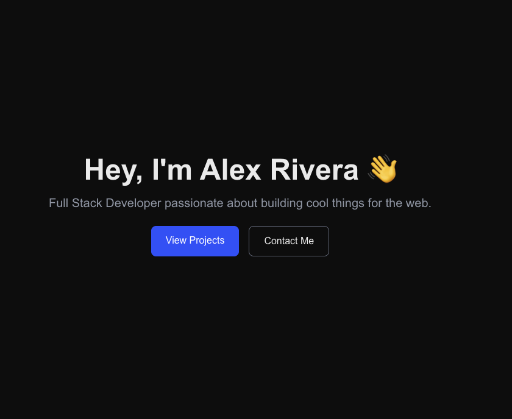
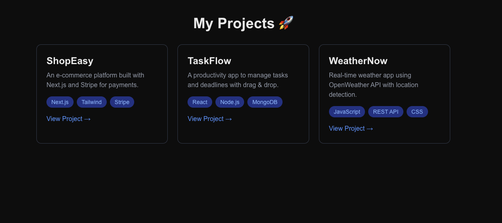
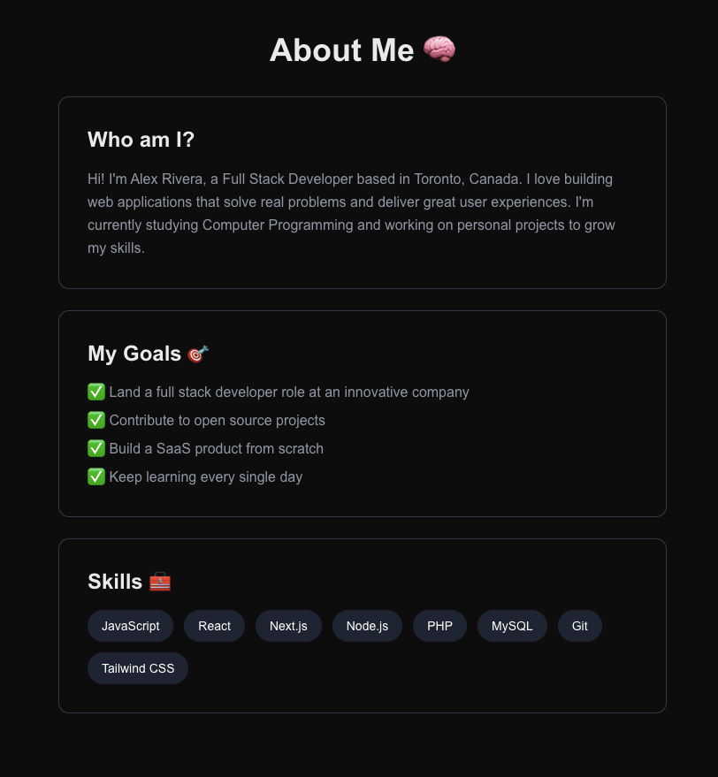
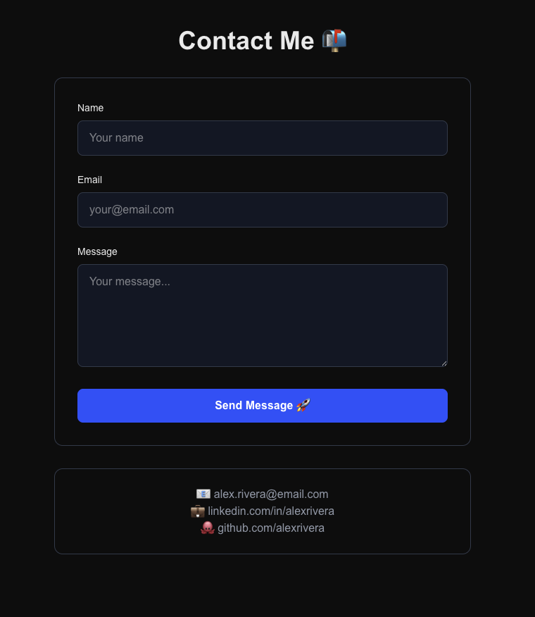

# ReactApp2 - Personal Portfolio (Next.js)

A personal portfolio site built with **Next.js** and **Tailwind CSS** as part of a college assignment.

## 🚀 Pages

- **Home** - Introduction and hero section
- **Projects** - Showcase of sample projects with tech stack badges
- **About** - Personal background, goals and skills
- **Contact** - Contact form with success state and placeholder info

## 🧰 Tech Stack

- [Next.js](https://nextjs.org/) - React framework with App Router
- [Tailwind CSS](https://tailwindcss.com/) - Utility-first CSS styling
- [TypeScript](https://www.typescriptlang.org/) - Type-safe JavaScript
- Git & GitHub - Version control

## 📦 Getting Started

```bash
# Install dependencies
npm install

# Run development server
npm run dev
```

Open [http://localhost:3000](http://localhost:3000) in your browser.

## 📁 Project Structure

```text
reactApp2/
├── app/
│   ├── about/
│   │   └── page.tsx
│   ├── contact/
│   │   └── page.tsx
│   ├── projects/
│   │   └── page.tsx
│   ├── globals.css
│   ├── layout.tsx
│   └── page.tsx
├── images/
├── public/
├── README.md
├── next.config.ts
├── package.json
└── tsconfig.json
```

## 📷 Screenshots

### Home



### Projects



### About



### Contact


